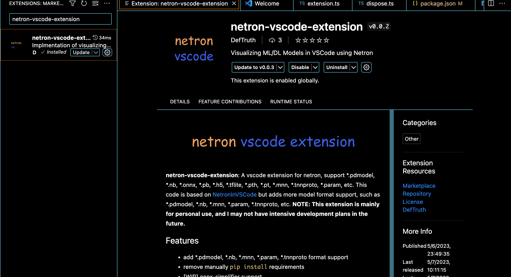
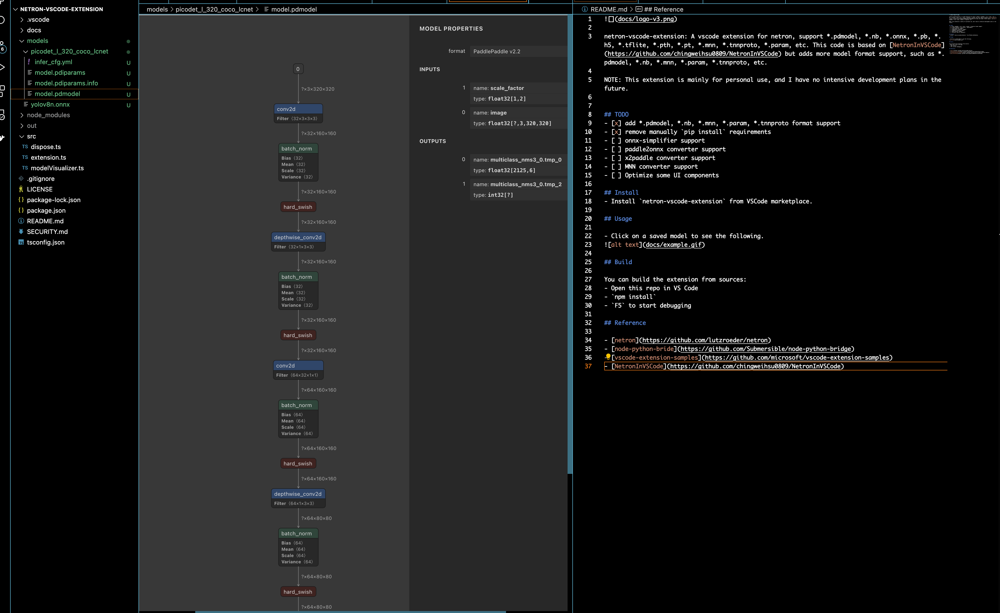

**netron-vscode-extension**: A vscode extension for netron, support *.pdmodel, *.nb, *.onnx, *.pb, *.h5, *.tflite, *.pth, *.pt, *.mnn, *.tnnproto, *.param, etc. This code is based on [NetronInVSCode](https://github.com/chingweihsu0809/NetronInVSCode) but adds more model format support, such as *.pdmodel, *.nb, *.mnn, *.param, *.tnnproto, etc. **NOTE: This extension is mainly for personal use, and I may not have intensive development plans in the future.**

## Features   

- [x] add *.pdmodel, *.nb, *.mnn, *.param, *.tnnproto format support
- [x] remove manually `pip install` requirements
- [ ] [WIP] onnx-simplifier support
- [ ] [WIP] paddle2onnx converter support
- [ ] [WIP] x2paddle converter support
- [ ] [WIP] MNN converter support
- [ ] [WIP] Optimize some UI components

## Install

- Install `netron-vscode-extension` from [vscode marketplace](https://marketplace.visualstudio.com/items?itemName=DefTruth.netron-vscode-extension). 


- Install `Python 3.x` on your computer. The step about netron installation follows is optional. This extension will call netron from python via [node-python-bride](https://github.com/Submersible/node-python-bridge) to form an url which contains the visualized contents, then, pass it to this extension. `netron-vscode-extension` will check whether the netron is avaliable on your python and auto install it if necessary.
	```bash
	python -m pip install netron  # optional
	```

## Usage

- Click on a saved model to see the following, such as [picodet](models/picodet_l_320_coco_lcnet/model.pdmodel), [yolov8n](models/yolov8n.onnx), etc.
 


## Build

You can build the extension from sources:
- Open this repo in VS Code
- `npm install`
- `F5` to start debugging

## LICENSE  

The codes is released under the MIT License.

## Reference

- [netron](https://github.com/lutzroeder/netron)
- [node-python-bride](https://github.com/Submersible/node-python-bridge)
- [vscode-extension-samples](https://github.com/microsoft/vscode-extension-samples)
- [NetronInVSCode](https://github.com/chingweihsu0809/NetronInVSCode)
