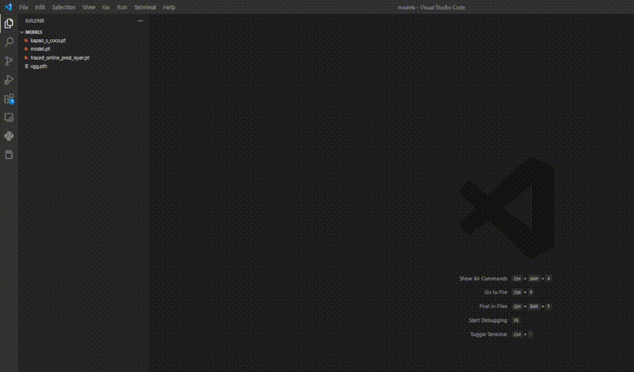

# netron-vscode-extension

A vscode extension for netron, support *.pdmodel, *.nb, *.onnx, *.pb, *.h5, *.tflite, *.pth, *.pt, *.mnn, *.param, etc.

## Disclaimer

Please note that this extension is developed by a beginner in vscode extention developing and is still in its early stages. It may contain many bugs, any feedback or bug reports are welcomed. Thank you for trying out this extension!

## Features

- Load and visualize saved models within Visual Studio Code
- View detailed information about each model component
- Supported file format: *.pdmodel, *.nb, *.onnx, *.pb, *.h5, *.tflite, *.pth, *.pt, *.mnn, *.param, etc.

## Requirements

- `npm install python-bridge`
- `pip install netron`

## Usage

- Install `Netron in VSCode` from VScode marketplace.
- Click on a saved model to see the following.

## Running the code

- Open this repo in VS Code
- `npm install`
- `F5` to start debugging

## Credits

This extension was built using

- [netron](https://github.com/lutzroeder/netron)
- [node-python-bride](https://github.com/Submersible/node-python-bridge)
- [vscode-extension-samples](https://github.com/microsoft/vscode-extension-samples)