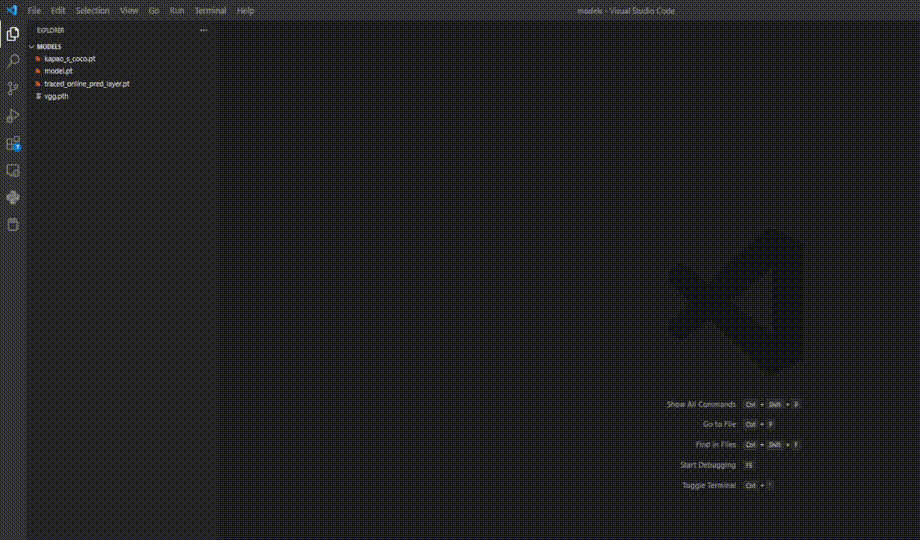

netron-vscode-extension: A vscode extension for netron, support *.pdmodel, *.nb, *.onnx, *.pb, *.h5, *.tflite, *.pth, *.pt, *.mnn, *.tnnproto, *.param, etc. This code is based on [NetronInVSCode](https://github.com/chingweihsu0809/NetronInVSCode) but adds more model format support, such as *.pdmodel, *.nb, *.mnn, *.param, *.tnnproto, etc.  

NOTE: This extension is mainly for personal use, and I have no intensive development plans in the future.

## TODO 
- [x] add *.pdmodel, *.nb, *.mnn, *.param, *.tnnproto format support
- [x] remove manually `pip install` requirements
- [ ] onnx-simplifier support
- [ ] paddle2onnx converter support
- [ ] x2paddle converter support
- [ ] MNN converter support
- [ ] Optimize some UI components

## Install
- Install `netron-vscode-extension` from VSCode marketplace.

## Usage

- Click on a saved model to see the following.  

## Build

You can build the extension from sources:
- Open this repo in VS Code
- `npm install`
- `F5` to start debugging

## Reference

- [netron](https://github.com/lutzroeder/netron)
- [node-python-bride](https://github.com/Submersible/node-python-bridge)
- [vscode-extension-samples](https://github.com/microsoft/vscode-extension-samples)
- [NetronInVSCode](https://github.com/chingweihsu0809/NetronInVSCode)